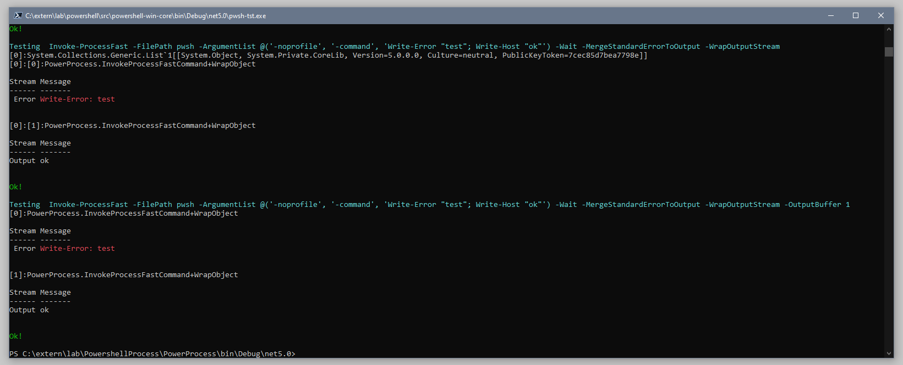

# PowerProcess

This module provides a faster replacement for Powershell `&` and `Start-Process`.

# Motive

The default implementation of powershell error stream allocates lots of objects and its very slow if you need to process the redirect error stream as strings, it also processes line by line with has a high burden on the pipeline.

Other important problem is that the default implementation until `Powershell 7.1.3` internally uses `Arguments` instead of `ArgumentList` besides being called ArgumentList, it is a `[string]`, which is unfortunate because of historical reasons.

# Improvements

* Added support for buffering `output` and `error` streams.
* Its not possible to call the shell by mistake.
* Support for the new VT terminals [WIP].
* Correct treatment of argument lists by the direct use of `System.Diagnostics.Process`.
* Possibility of merging `output` and `error` at the source.

## Install

Available in PSGallery: [https://www.powershellgallery.com/packages/PowerProcess](https://www.powershellgallery.com/packages/PowerProcess)

```pwsh
Install-Module -Name PowerProcess
```

## Usage

```pwsh


NAME
    Invoke-ProcessFast

SYNTAX
    Invoke-ProcessFast [-FilePath] <string> [[-ArgumentList] <string[]>] [-WorkingDirectory <string>] [-PassThru]
    [-DontRedirectOutputs] [-MergeStandardErrorToOutput] [-WrapOutputStream] [-Wait] [-InputObject <string>]
    [-OutputBuffer <int>] [-WhatIf] [-Confirm] [<CommonParameters>]

    Invoke-ProcessFast [-Credential <pscredential>] [-LoadUserProfile] [-PassThru] [-DontRedirectOutputs]
    [-MergeStandardErrorToOutput] [-WrapOutputStream] [-Wait] [-UseNewEnvironment] [-InputObject <string>]
    [-OutputBuffer <int>] [-WhatIf] [-Confirm] [<CommonParameters>]


ALIASES
    None


REMARKS
    None


PS C:\Users\LuizMonad\Desktop\PowershellProcess\PowerProcess\bin\Debug\net5.0> get-help Invoke-ProcessFast -full

NAME
    Invoke-ProcessFast

SYNTAX
    Invoke-ProcessFast [-FilePath] <string> [[-ArgumentList] <string[]>] [-WorkingDirectory <string>] [-PassThru]
    [-DontRedirectOutputs] [-MergeStandardErrorToOutput] [-WrapOutputStream] [-Wait] [-InputObject <string>]
    [-OutputBuffer <int>] [-WhatIf] [-Confirm] [<CommonParameters>]

    Invoke-ProcessFast [-Credential <pscredential>] [-LoadUserProfile] [-PassThru] [-DontRedirectOutputs]
    [-MergeStandardErrorToOutput] [-WrapOutputStream] [-Wait] [-UseNewEnvironment] [-InputObject <string>]
    [-OutputBuffer <int>] [-WhatIf] [-Confirm] [<CommonParameters>]


PARAMETERS
    -ArgumentList <string[]>

        Required?                    false
        Position?                    1
        Accept pipeline input?       false
        Parameter set name           ScriptBlock
        Aliases                      Args
        Dynamic?                     false
        Accept wildcard characters?  false

    -Confirm

        Required?                    false
        Position?                    Named
        Accept pipeline input?       false
        Parameter set name           (All)
        Aliases                      cf
        Dynamic?                     false
        Accept wildcard characters?  false

    -Credential <pscredential>

        Required?                    false
        Position?                    Named
        Accept pipeline input?       false
        Parameter set name           WinEnv
        Aliases                      RunAs
        Dynamic?                     false
        Accept wildcard characters?  false

    -DontRedirectOutputs

        Required?                    false
        Position?                    Named
        Accept pipeline input?       false
        Parameter set name           (All)
        Aliases                      NoRedir
        Dynamic?                     false
        Accept wildcard characters?  false

    -FilePath <string>

        Required?                    true
        Position?                    0
        Accept pipeline input?       false
        Parameter set name           ScriptBlock
        Aliases                      PSPath, Path
        Dynamic?                     false
        Accept wildcard characters?  false

    -InputObject <string>

        Required?                    false
        Position?                    Named
        Accept pipeline input?       true (ByValue)
        Parameter set name           (All)
        Aliases                      None
        Dynamic?                     false
        Accept wildcard characters?  false

    -LoadUserProfile

        Required?                    false
        Position?                    Named
        Accept pipeline input?       false
        Parameter set name           WinEnv
        Aliases                      Lup
        Dynamic?                     false
        Accept wildcard characters?  false

    -MergeStandardErrorToOutput

        Required?                    false
        Position?                    Named
        Accept pipeline input?       false
        Parameter set name           (All)
        Aliases                      Merge
        Dynamic?                     false
        Accept wildcard characters?  false

    -OutputBuffer <int>

        Required?                    false
        Position?                    Named
        Accept pipeline input?       false
        Parameter set name           (All)
        Aliases                      None
        Dynamic?                     false
        Accept wildcard characters?  false

    -PassThru

        Required?                    false
        Position?                    Named
        Accept pipeline input?       false
        Parameter set name           (All)
        Aliases                      None
        Dynamic?                     false
        Accept wildcard characters?  false

    -UseNewEnvironment

        Required?                    false
        Position?                    Named
        Accept pipeline input?       false
        Parameter set name           WinEnv
        Aliases                      None
        Dynamic?                     false
        Accept wildcard characters?  false

    -Wait

        Required?                    false
        Position?                    Named
        Accept pipeline input?       false
        Parameter set name           (All)
        Aliases                      None
        Dynamic?                     false
        Accept wildcard characters?  false

    -WhatIf

        Required?                    false
        Position?                    Named
        Accept pipeline input?       false
        Parameter set name           (All)
        Aliases                      wi
        Dynamic?                     false
        Accept wildcard characters?  false

    -WorkingDirectory <string>

        Required?                    false
        Position?                    Named
        Accept pipeline input?       false
        Parameter set name           ScriptBlock
        Aliases                      None
        Dynamic?                     false
        Accept wildcard characters?  false

    -WrapOutputStream

        Required?                    false
        Position?                    Named
        Accept pipeline input?       false
        Parameter set name           (All)
        Aliases                      Obj
        Dynamic?                     false
        Accept wildcard characters?  false

    <CommonParameters>
        This cmdlet supports the common parameters: Verbose, Debug,
        ErrorAction, ErrorVariable, WarningAction, WarningVariable,
        OutBuffer, PipelineVariable, and OutVariable. For more information, see
        about_CommonParameters (https://go.microsoft.com/fwlink/?LinkID=113216).


INPUTS
    System.String


OUTPUTS
    System.Diagnostics.Process
  or
    System.String


ALIASES
    None


REMARKS
    None


```

## EXAMPLES

### Example 1: Start a process redirect all of its streams.

This example starts a process that will redirect its error stream to output as a `string`.

```powershell
Invoke-ProcessFast -FilePath pwsh -ArgumentList @('-noprofile', '-command', '0; 1; 2; 3') -MergeStandardErrorToOutput
```

### Example 2: Start a process redirect all of its streams as objects.

This example starts a process that will redirect its streams to output objects so you can differentiate 
which stream it came from.

```powershell
Invoke-ProcessFast -FilePath pwsh -ArgumentList @('-noprofile', '-command', '0; 1; 2; 3') -MergeStandardErrorToOutput -WrapOutputStream
```

### Example 3: Start a process while without buffering its output in a list.

This example starts a process that wont buffer the processing in a list, this is a optimizations that 
shouldn't matter for `ForEach-Object` or sending to the `Host` or `Transcript` or using `foreach`, 
but in some cases you may want to disable it or change the default value, to disable this feature,
set the buffer to `1`, the default value is `256`.

```powershell
Invoke-ProcessFast -FilePath pwsh -ArgumentList @('-noprofile', '-command', '0; 1; 2; 3') -MergeStandardErrorToOutput -WrapOutputStream -OutputBuffer 1
```



## PARAMETERS

### -ArgumentList

Specifies parameters or parameter values to use when this cmdlet starts the process. Arguments can
be accepted as a single string with the arguments separated by spaces, or as an array of strings
separated by commas. The cmdlet joins the array into a single string with each element of the array
separated by a single space.

The outer quotes of the PowerShell strings are not included when the **ArgumentList** values are
passed to the new process. If parameters or parameter values contain a space or quotes, they need to
be surrounded with escaped double quotes. For more information, see
[about_Quoting_Rules](../Microsoft.PowerShell.Core/About/about_Quoting_Rules.md).

```yaml
Type: System.String[]
Parameter Sets: (All)
Aliases: Args

Required: False
Position: 1
Default value: None
Accept pipeline input: False
Accept wildcard characters: False
```
### -PassThru

Returns a process object for each process that the cmdlet started. By default, this cmdlet does not
generate any output.

```yaml
Type: System.Management.Automation.SwitchParameter
Parameter Sets: (All)
Aliases:

Required: False
Position: Named
Default value: None
Accept pipeline input: False
Accept wildcard characters: False
```
### -Wait

Indicates that this cmdlet waits for the specified process and its descendants to complete before
accepting more input. This parameter suppresses the command prompt or retains the window until the
processes finish.

```yaml
Type: System.Management.Automation.SwitchParameter
Parameter Sets: (All)
Aliases:

Required: False
Position: Named
Default value: None
Accept pipeline input: False
Accept wildcard characters: False
```

### -WorkingDirectory

Specifies the location that the new process should start in. The default is the location of the
executable file or document being started. Wildcards are not supported. The path name must not
contain characters that would be interpreted as wildcards.

```yaml
Type: System.String
Parameter Sets: (All)
Aliases:

Required: False
Position: Named
Default value: None
Accept pipeline input: False
Accept wildcard characters: False
```

### -Confirm

Prompts you for confirmation before running the cmdlet.

```yaml
Type: System.Management.Automation.SwitchParameter
Parameter Sets: (All)
Aliases: cf

Required: False
Position: Named
Default value: None
Accept pipeline input: False
Accept wildcard characters: False
```

### -WhatIf

Shows what would happen if the cmdlet runs. The cmdlet is not run.

This parameter was introduced in PowerShell 6.0.

```yaml
Type: System.Management.Automation.SwitchParameter
Parameter Sets: (All)
Aliases: wi

Required: False
Position: Named
Default value: None
Accept pipeline input: False
Accept wildcard characters: False
```

### CommonParameters

This cmdlet supports the common parameters: -Debug, -ErrorAction, -ErrorVariable,
-InformationAction, -InformationVariable, -OutVariable, -OutBuffer, -PipelineVariable, -Verbose,
-WarningAction, and -WarningVariable. For more information, see
[about_CommonParameters](https://go.microsoft.com/fwlink/?LinkID=113216).

## INPUTS

### None

You can pipe input to this cmdlet, it will be converted to string and sent
synchonously to the process.

## OUTPUTS

### None, System.Diagnostics.Process

This cmdlet generates a **System.Diagnostics.Process** object, if you specify the **PassThru**
parameter. Otherwise, this cmdlet does not return any output.

## NOTES

- When using the **Wait** parameter, `Invoke-ProcessFast` waits for the created process to exit before returning control. This is different than the behavior of the 
  `Start-Process` cmdlet, which waits for the process tree (windows job).

- This cmdlet is implemented by using the **Start** method of the **System.Diagnostics.Process**
  class. For more information about this method, see
  [Process.Start Method](/dotnet/api/system.diagnostics.process.start#overloads).

- On Windows, when you use **UseNewEnvironment**, the new process starts only containing the default
  environment variables defined for the **Machine** scope. This has the side affect that the
  `$env:USERNAME` is set to **SYSTEM**. None of the variables from the **User** scope are included.


# Related Projects and scripts

This provides a way to return all the output as error when the process `ExitCode` is non-zero. But it saves `output` and `error` as temporary files, so we lose streamming, which is no good.
It also doesn't solve the problem with escaping arguments.

[Adam Bertram blog post](https://adamtheautomator.com/start-process/)

[Invoke-Process on the gallery](https://www.powershellgallery.com/packages/Invoke-Process/1.4/Content/Invoke-Process.ps1)

-------------------------------------------------

This person provides a better implementation of Invoke-Process than Adam's one, because it uses `BeginOutputReadLine` and `BeginErrorReadLine` instead of temporary files.
But it also suffers from the same problems, its a bit better in that it directly uses `System.Diagnostics.Process`

[guitarrapc_tech blog post](https://tech.guitarrapc.com/entry/2014/12/14/075248)

[Invoke-Process on their utils github repo](https://github.com/guitarrapc/PowerShellUtil/tree/master/Invoke-Process)

-------------------------------------------------

This also suffer from the same problems, its bit simpler implementation worth mentioning

[Relevant discussion](https://bleepcoder.com/powershell/648485701/call-native-operator)

[Invoke-NativeCommand mentioned](https://gist.github.com/indented-automation/fba795c43ef5a53483398cdc72ab7fa0)

------------------------------------------------

And the final implementation I found was this in a citation from `mklement0` in one of the discussions on github issues.
It solves the problem with the arguments, it kind of play well with streams, it does the right thing in relation with ordering of error and input, but it doesn't play well with the powershell pipeline, it redirects the entire buffer to a variable, which is not that nice if you want realtime processing as the process generates the output.

[Invoke-ExternalCommand](https://github.com/choovick/ps-invoke-externalcommand)

